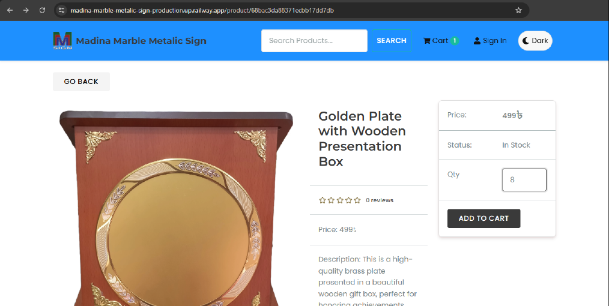

# Madina Marble Metallic Sign Production

**Professional E-Commerce Platform** | MERN Stack (MongoDB + Express + React + Node.js)

## 🎯 Purpose

Full-featured e-commerce website for Madina Marble Metallic Sign business. Built with modern MERN stack demonstrating production-ready development practices including user authentication, shopping cart, order management, and admin panel.

## ✨ Features

✅ **Product Catalog** - Browse products with search, pagination & top products carousel  
✅ **Product Details** - Images, descriptions, ratings, reviews, stock status  
✅ **Shopping Cart** - Add/remove items, adjust quantities, real-time total  
✅ **User Authentication** - Register, login, JWT-based auth with cookies  
✅ **User Profile** - Update info, view order history  
✅ **Checkout Process** - Shipping address, payment method selection  
✅ **Order Management** - Place orders, track status, view details  
✅ **Product Reviews** - Rate and review products (authenticated users)  
✅ **Admin Dashboard** - Manage products, users, and orders  
✅ **Admin Controls** - Full CRUD for products, mark orders as delivered  
✅ **Search & Filter** - Search products by keyword  
✅ **Responsive Design** - Mobile, tablet, desktop ready

## 🛠️ Tech Stack

| Layer | Technology |
|-------|-----------|
| **Frontend** | React 18 (Functional Components + Hooks) |
| **Backend** | Node.js + Express.js |
| **Database** | MongoDB + Mongoose ODM |
| **State Management** | Redux Toolkit + RTK Query |
| **UI Framework** | React Bootstrap 5 |
| **Authentication** | JWT (JSON Web Tokens) + HTTP-only Cookies |
| **File Upload** | Multer |
| **API Style** | RESTful API |

## 📦 Installation

### Prerequisites

- Node.js 18+ & NPM
- MongoDB Atlas account (or local MongoDB)
- Git

### Setup Steps

**1. Clone repository**
```bash
git clone https://github.com/ratul-official29/madina-marble-metalic-sign.git
cd madina-marble-metalic-sign
```

**2. Install dependencies**
```bash
npm install
cd frontend
npm install
cd ..
```

**3. Configure environment**
Create `.env` file in root:
```env
NODE_ENV=development
PORT=5000
MONGO_URI=your_mongodb_connection_string
JWT_SECRET=your_jwt_secret_key
PAGINATION_LIMIT=8
EMAIL_USER=your_email@gmail.com
EMAIL_PASS=your_email_app_password
FRONTEND_URL=http://localhost:3000
```

**4. Seed database**
```bash
npm run data:import
```

This creates sample users and products:
- Admin user: admin@email.com / 123456
- Regular users + 6 demo products

**5. Start development servers**

Run both frontend and backend:
```bash
npm run dev
```

Or separately:
- Backend: `npm run server` (http://localhost:5000)
- Frontend: `npm run client` (http://localhost:3000)

**6. Access application**
```
http://localhost:3000
```

## 🗄️ Database Schema

**users**
- id, name, email, password (hashed), isAdmin
- Relationship: hasMany orders, hasMany reviews

**products**
- id, user, name, image, brand, category, description
- price, countInStock, rating, numReviews, reviews[]
- Relationship: belongsTo user, hasMany reviews, hasMany orderItems

**orders**
- id, user, orderItems[], shippingAddress, paymentMethod
- itemsPrice, taxPrice, shippingPrice, totalPrice
- isPaid, paidAt, isDelivered, deliveredAt
- Relationship: belongsTo user, hasMany orderItems

**reviews** (embedded in products)
- name, rating, comment, user, timestamps

## 📌 API Endpoints

| Method | Endpoint | Description | Auth |
|--------|----------|-------------|------|
| **Products** |
| GET | `/api/products` | Get all products (paginated) | Public |
| GET | `/api/products/:id` | Get single product | Public |
| POST | `/api/products` | Create product | Admin |
| PUT | `/api/products/:id` | Update product | Admin |
| DELETE | `/api/products/:id` | Delete product | Admin |
| POST | `/api/products/:id/reviews` | Create review | User |
| GET | `/api/products/top` | Get top rated products | Public |
| **Users** |
| POST | `/api/users/auth` | Login user | Public |
| POST | `/api/users` | Register user | Public |
| POST | `/api/users/logout` | Logout user | User |
| GET | `/api/users/profile` | Get user profile | User |
| PUT | `/api/users/profile` | Update profile | User |
| GET | `/api/users` | Get all users | Admin |
| GET | `/api/users/:id` | Get user by ID | Admin |
| PUT | `/api/users/:id` | Update user | Admin |
| DELETE | `/api/users/:id` | Delete user | Admin |
| **Orders** |
| POST | `/api/orders` | Create order | User |
| GET | `/api/orders/myorders` | Get user orders | User |
| GET | `/api/orders/:id` | Get order by ID | User |
| PUT | `/api/orders/:id/deliver` | Mark as delivered | Admin |
| GET | `/api/orders` | Get all orders | Admin |
| **Upload** |
| POST | `/api/upload` | Upload image | Admin |

## 🚀 Deployment

### Railway (Production)

**1. Push to GitHub**
```bash
git add .
git commit -m "Ready for deployment"
git push origin main
```

**2. Deploy on Railway**
- Visit [railway.app](https://railway.app)
- Create new project from GitHub repo
- Add MongoDB database (or use MongoDB Atlas)
- Set environment variables
- Deploy automatically

**3. Environment Variables**
```env
NODE_ENV=production
PORT=5000
MONGO_URI=your_production_mongodb_uri
JWT_SECRET=your_strong_secret_key
PAGINATION_LIMIT=8
EMAIL_USER=your_email
EMAIL_PASS=your_email_password
FRONTEND_URL=https://your-app.up.railway.app
```

**Live Demo**: https://madina-marble-metalic-sign-production.up.railway.app/

## 🧪 Testing

**User Flow**
1. Browse products on homepage
2. Search for specific products
3. Click product to view details
4. Add to cart with quantity
5. Register/login
6. Proceed to checkout
7. Enter shipping address
8. Select payment method
9. Review and place order
10. View order confirmation

**Admin Flow**
1. Login as admin
2. Access admin panel from dropdown
3. Manage products (Create/Edit/Delete)
4. View all orders
5. Mark orders as delivered
6. Manage users

## 📸 Screenshots

<div align="center">
  
</div>
<div align="center">
  
</div>
<div align="center">
  
</div>
<div align="center">
  
</div>
<div align="center">
  
</div>
<div align="center">
  
</div>
<div align="center">
  
</div>

## 🎨 Features Showcase

**Frontend**
- Product grid with images and ratings
- Product carousel for top items
- Real-time search with keyword highlighting
- Shopping cart with quantity controls
- Multi-step checkout process
- Order tracking page
- User profile with order history
- Admin dashboard with management tools

**Backend**
- RESTful API architecture
- JWT authentication with HTTP-only cookies
- Password hashing with bcrypt
- MongoDB with Mongoose ODM
- Error handling middleware
- File upload functionality
- Order calculation utilities
- Database seeding scripts

## 💼 Admin Credentials

**Email**: admin@email.com  
**Password**: 123456

*Change these in production!*

## 👤 Author

**Shaikh Radwan Ahmed Ratul**
- 📧 Email: ratulrs29@gmail.com
- 💼 LinkedIn: [linkedin.com/in/shaikh-radwan-374435358](https://www.linkedin.com/in/shaikh-radwan-374435358/)
- 🐙 GitHub: [@rad129ratul](https://github.com/rad129ratul)

## 📄 License

MIT License - Free to use for learning and portfolio

## 🙏 Acknowledgments

Built following MERN stack best practices:
- MongoDB documentation
- Express.js documentation
- React documentation
- Redux Toolkit documentation
- Node.js best practices

## 🔥 Quick Start Commands

```bash
# Install all dependencies
npm install && cd frontend && npm install && cd ..

# Setup environment
cp .env.example .env

# Seed database
npm run data:import

# Run development
npm run dev

# Build for production
npm run build

# Start production
npm start

# Destroy seeded data
npm run data:destroy
```

## 💡 Development Notes

- **Port**: Backend runs on 5000, Frontend on 3000
- **Pagination**: 8 products per page
- **Tax Rate**: 15% (configurable in calcPrices.js)
- **Shipping**: Free over $100, else $10
- **Currency**: US Dollar ($)
- **Image Upload**: Multer handles file storage in `/uploads`
- **Authentication**: JWT stored in HTTP-only cookies
- **CORS**: Enabled for production deployment

## 🔐 Security Features

- Password hashing with bcryptjs
- JWT token-based authentication
- HTTP-only cookies prevent XSS
- Protected routes (user & admin)
- Input validation and sanitization
- MongoDB injection prevention with Mongoose

## 📚 Project Structure

```
├── backend/
│   ├── config/          # Database configuration
│   ├── controllers/     # Route controllers
│   ├── data/            # Seed data
│   ├── middleware/      # Custom middleware
│   ├── models/          # Mongoose models
│   ├── routes/          # API routes
│   ├── utils/           # Helper functions
│   └── server.js        # Express app entry
├── frontend/
│   ├── public/          # Static files
│   └── src/
│       ├── components/  # React components
│       ├── screens/     # Page components
│       ├── slices/      # Redux slices
│       ├── utils/       # Helper functions
│       └── store.js     # Redux store
├── uploads/             # Uploaded images
└── package.json         # Root dependencies
```